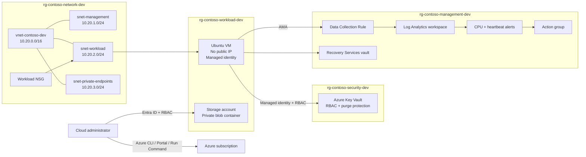

# Azure Small-Business Foundation

A hands-on Azure administration portfolio project that builds a **secure, monitored, recoverable, and cost-conscious foundation** for a fictional small business in **Canada Central**.

The project focuses on practical entry-level cloud operations: resource organization, private networking, identity-based access, secret management, centralized monitoring, alert validation, backup, troubleshooting, and cleanup.

## What Was Built

| Area | Implementation |
|---|---|
| Governance | Four purpose-specific resource groups, naming conventions, project tags, budget alert |
| Networking | VNet with management, workload, and private-endpoint subnets; subnet-level NSG |
| Compute | Private Ubuntu VM with no public IP, SSH keys, boot diagnostics, auto-shutdown, Nginx via cloud-init |
| Identity | System-assigned managed identity and least-privilege Azure RBAC |
| Storage | StorageV2 account, HTTPS-only, TLS 1.2, private blob container, Entra ID data-plane access |
| Secrets | Key Vault with RBAC, soft delete, purge protection, and managed-identity secret retrieval |
| Monitoring | Log Analytics, Azure Monitor Agent, Data Collection Rule, Heartbeat, Perf, and Syslog |
| Alerting | High-CPU metric alert, missing-heartbeat log alert, action group, fired/resolved email tests |
| Recovery | Recovery Services vault, LRS backup storage, VM protection, successful backup and recovery point |
| Operations | KQL queries, incident report, access and cleanup runbooks, deployment evidence |

## Architecture



A detailed design discussion is available in [docs/architecture/architecture.md](docs/architecture/architecture.md).

## Security and Design Decisions

- The VM has **no public IP address** and does not expose SSH to the internet.
- Azure Run Command was used for controlled administrative validation; a VPN, ExpressRoute, or Bastion would be a production access option, but Bastion was intentionally excluded from this cost-conscious lab.
- Workload access to Key Vault uses a **system-assigned managed identity**, not embedded credentials.
- RBAC assignments are scoped to the required resource and role.
- Blob access was validated with Microsoft Entra ID rather than account keys.
- Monitoring collection is explicitly controlled through an Azure Monitor Data Collection Rule.
- Backup uses locally redundant storage to match the lab's cost objective.

## Monitoring and Incident Validation

The Linux VM sends Heartbeat, performance counters, and selected Syslog facilities to Log Analytics through Azure Monitor Agent. Two alerts were tested end to end:

1. **High CPU** — sustained processor load caused the metric alert to fire and then resolve.
2. **Missing heartbeat** — stopping the VM caused the log alert to fire; restarting it restored heartbeat and resolved the incident.

Reusable queries are stored in [`queries/`](queries/), and the tested scenario is documented in [the sample incident report](docs/incidents/sample-incident.md).

## Repository Guide

```text
.
├── docs/
│   ├── architecture/       # Detailed design and Mermaid architecture
│   ├── examples/           # Sanitized validation output
│   ├── incidents/          # Sample operational incident report
│   ├── runbooks/           # VM access and cleanup procedures
│   └── screenshots/        # Deployment evidence and gallery
├── infrastructure/
│   ├── env/                # Non-secret project variables
│   ├── monitoring/         # DCR Bicep template
│   ├── cloud-init.yaml     # Initial VM configuration
│   └── README.md           # Implementation notes and validation commands
├── queries/                # KQL for health and security investigations
└── scripts/                # Guarded helper scripts for validation/deployment and cleanup
```

## Evidence

The repository includes **42 numbered screenshots** covering governance, networking, VM security, storage, Key Vault, monitoring, alerts, and backup. See the [Screenshot Gallery](docs/screenshots/gallery.md).

## Cost Controls

- Subscription budget and alert
- VM auto-shutdown
- Cost-aware VM sizing
- 30-day Log Analytics retention
- Locally redundant backup storage
- No continuously running Bastion resource
- Explicit cleanup runbook and guarded cleanup script

## Skills Demonstrated

Azure CLI, Azure networking, NSGs, Linux VM administration, cloud-init, managed identities, Azure RBAC, Storage, Key Vault, Azure Monitor Agent, Data Collection Rules, Log Analytics, KQL, alerts, Recovery Services vaults, Azure Backup, Bicep validation, Git, documentation, troubleshooting, and incident response.

## Reproduce or Review

This repository documents a manually deployed learning environment rather than pretending to be a complete one-command production deployment. The helper scripts validate prerequisites, deploy the version-controlled DCR, and provide guarded cleanup. Review [infrastructure/README.md](infrastructure/README.md) before running anything.

## Project Scope

This is a portfolio lab, not an enterprise landing zone. Production improvements would include private endpoints, firewall-restricted PaaS access, centralized identity governance, policy assignments, CI/CD, infrastructure-as-code coverage for all resources, and formal recovery testing.

## License

See [LICENSE](LICENSE).
