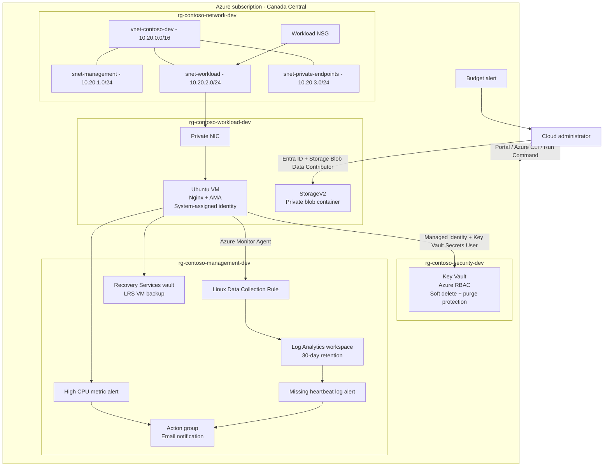

# Architecture Design

## Purpose

This design provides a small organization with a private application host, controlled identity-based access to platform services, centralized observability, alerting, and VM recovery while keeping the lab understandable and inexpensive.

## Logical Architecture

## Resource Organization

| Resource group | Responsibility | Lifecycle rationale |
|---|---|---|
| `rg-contoso-network-dev` | VNet, subnets, NSGs | Shared connectivity changes less frequently than workloads |
| `rg-contoso-workload-dev` | VM, NIC, storage | Application resources can be managed or removed together |
| `rg-contoso-security-dev` | Key Vault and security controls | Separates sensitive services and access assignments |
| `rg-contoso-management-dev` | Monitoring, alerts, action group, backup | Centralizes operational tooling and recovery services |

Common tags are `Project`, `Environment=Development`, `Owner`, `CostCenter=PortfolioLab`, `ManagedBy`, and an expiration date where applicable.

## Network Design

The VNet address space is `10.20.0.0/16`.

| Subnet | CIDR | Use |
|---|---|---|
| `snet-management` | `10.20.1.0/24` | Reserved management connectivity |
| `snet-workload` | `10.20.2.0/24` | Private application VM and NIC |
| `snet-private-endpoints` | `10.20.3.0/24` | Reserved for future private endpoints |

The VM has no public IP. The workload subnet is protected by an NSG, and direct internet SSH is not part of the design. Azure Run Command supplied controlled administrative access during the lab. A production environment could add VPN/ExpressRoute or Bastion after a cost and security review; Bastion is not deployed in this repository.

## Identity and Secrets Flow

1. The VM requests a token from Azure Instance Metadata Service.
2. Microsoft Entra ID issues a token for the VM's system-assigned managed identity.
3. The VM calls Key Vault using that token.
4. Key Vault evaluates the vault-scoped `Key Vault Secrets User` role assignment.
5. The authorized secret is returned without a password, access key, or service-principal secret on disk.

Administrative secret management uses the separate `Key Vault Secrets Officer` role, demonstrating separation of duties.

## Storage Design

The StorageV2 account uses Standard LRS, HTTPS-only access, minimum TLS 1.2, and disabled anonymous blob access. The application container is private. Data-plane operations were tested with Microsoft Entra ID and `Storage Blob Data Contributor` rather than storage keys.

Public network and shared-key access remained enabled where required for lab validation. Private endpoints, firewall rules, and disabling shared keys are documented production hardening steps.

## Monitoring and Alerting Flow

Azure Monitor Agent runs on the VM. A Linux Data Collection Rule selects performance counters and Syslog facilities and sends them to the Log Analytics workspace.

Collected telemetry includes:

- Heartbeat
- Total CPU utilization
- Available memory
- Logical disk free space
- `auth`, `authpriv`, `daemon`, `syslog`, and `user` Syslog facilities

A metric alert detects sustained high CPU. A scheduled-query alert detects missing heartbeat data. Both route through an action group using the common alert schema and were validated through fired and resolved email notifications.

## Backup and Recovery

A Recovery Services vault in Canada Central protects the VM with a daily policy. The vault uses locally redundant storage for this cost-conscious development lab. Soft delete and enhanced security were verified. An on-demand backup completed and produced a file-system-consistent recovery point.

The project validates backup creation, not a destructive restore test. A production rollout would include recurring restore drills and defined RPO/RTO targets.

## Key Trade-offs

- **Private VM, simple administration:** Run Command avoids a public endpoint but is not a full replacement for persistent private connectivity.
- **Cost over regional durability:** LRS backup is appropriate for the lab; GRS may be preferred for higher resilience requirements.
- **Selective telemetry:** The DCR collects useful operational data without ingesting every possible log.
- **Manual deployment with targeted Bicep:** The project prioritizes learning Azure administration. Full infrastructure-as-code coverage is intentionally reserved for a separate Terraform/Bicep project.
